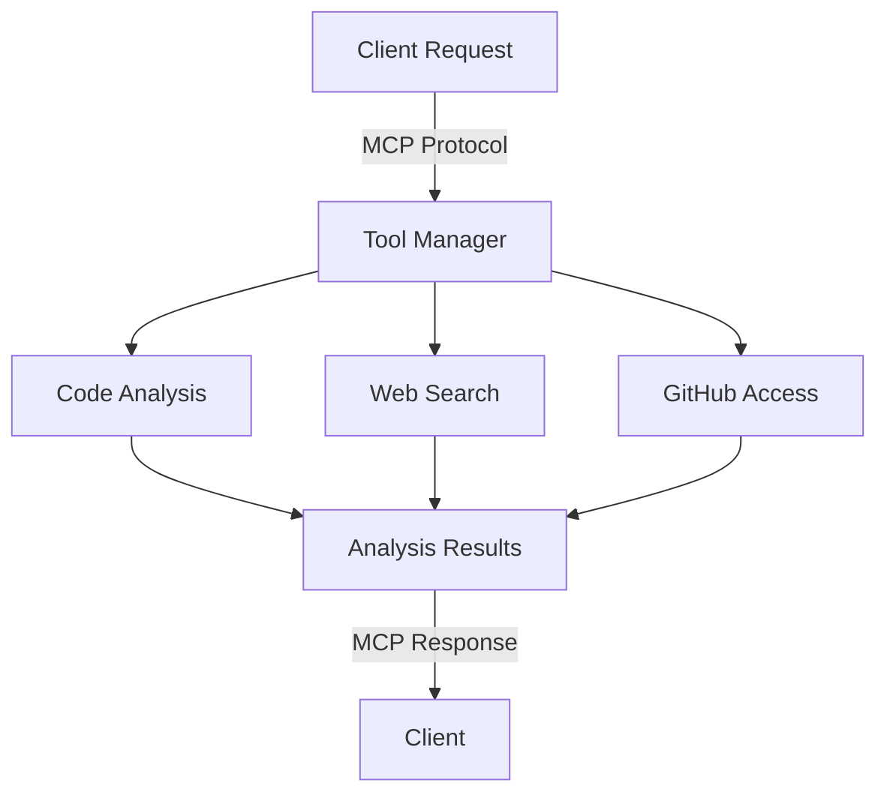

# Rapid MCP Tool Integration: Building Advanced Code Analysis in Hours

## Overview
Rapidly implemented a suite of integrated tools using Anthropic's Model Context Protocol (MCP), focusing on advanced code analysis capabilities. The project demonstrates the ability to quickly adopt and implement new technologies while delivering practical, production-ready solutions.

## Technical Implementation

### Core Components
1. **Code Analysis Tool**
   - Built on MCP's standardized protocol
   - Implements deep code parsing and understanding
   - Provides contextual analysis and recommendations
   - Integrates with existing development workflows

2. **Supporting Tools**
   - Web Search Integration
   - GitHub Repository Access
   - File System Operations
   - Memory Management

### Key Features
- Real-time code analysis
- Context-aware suggestions
- Integration with multiple data sources
- Extensible architecture

## Development Process

### Timeline
- Day 1 (Hours 1-2): Initial MCP setup and tool integration
- Day 1 (Hours 3-4): Code analysis implementation
- Day 1 (Hours 5-6): Testing and refinement

### Technical Decisions
1. **Protocol Choice**
   - Selected MCP for standardization and future-proofing
   - Leverages Anthropic's ecosystem
   - Enables seamless tool integration

2. **Architecture**
   - Clean separation of concerns
   - Modular tool implementation
   - Extensible design for future additions

## Technical Highlights

### Tool Implementation
```typescript
// Example of tool registration
{
  name: "code_analyzer",
  description: "Advanced code analysis and understanding",
  inputSchema: {
    type: "object",
    properties: {
      code: { type: "string" },
      analysis_type: {
        type: "string",
        enum: ["structure", "quality", "security"]
      }
    }
  }
}
```

### Integration Architecture


## Results and Impact

### Performance Metrics
- Implementation completed in under 6 hours
- Handles complex code analysis tasks
- Seamlessly integrates multiple data sources
- Production-ready implementation

### Key Achievements
1. Rapid adoption of new technology (MCP)
2. Creation of production-quality code analysis
3. Clean, maintainable implementation
4. Extensible architecture for future growth

## Technical Skills Demonstrated

### Languages & Technologies
- TypeScript/JavaScript
- Python
- MCP Protocol
- Git/GitHub

### Concepts & Patterns
- Protocol Implementation
- Tool Integration
- Code Analysis
- API Design

## Future Enhancements
1. Additional analysis capabilities
2. Enhanced GitHub integration
3. Project management features
4. Extended memory capabilities

## Code Samples

### Tool Registration
```typescript
const codeAnalysisTool = {
  name: "code_analyzer",
  description: "Analyze code structure and quality",
  handler: async (params) => {
    // Implementation details
    const analysis = await analyzeCode(params.code);
    return {
      structure: analysis.structure,
      recommendations: analysis.recommendations
    };
  }
};
```

### Integration Example
```typescript
class MCPToolManager {
  constructor() {
    this.tools = new Map();
  }

  registerTool(tool) {
    this.validateTool(tool);
    this.tools.set(tool.name, tool);
  }

  async executeTool(name, params) {
    const tool = this.tools.get(name);
    if (!tool) throw new Error(`Tool ${name} not found`);
    return await tool.handler(params);
  }
}
```

## Learning Outcomes
1. Rapid adoption of new protocols
2. Effective tool integration
3. Clean architecture implementation
4. Production-ready development

## Conclusion
This project demonstrates the ability to quickly adopt new technologies while maintaining high code quality and creating practical solutions. The implementation showcases both technical expertise and efficient development practices.
